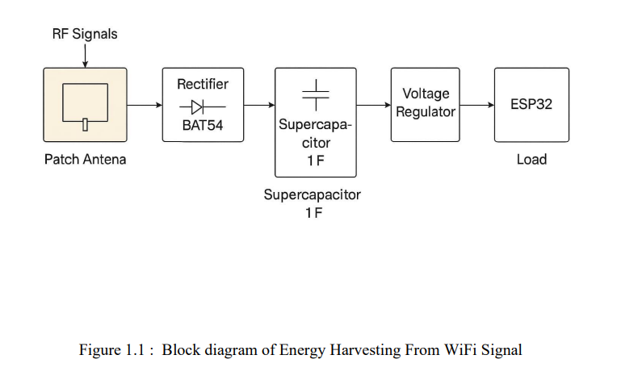
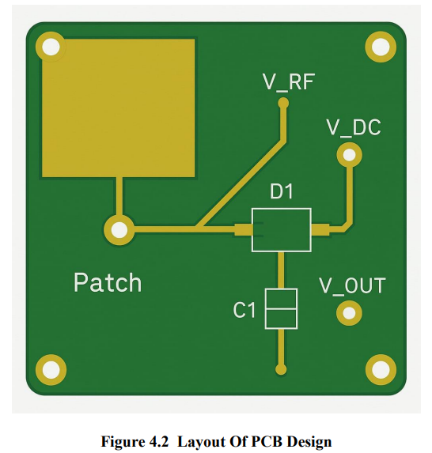
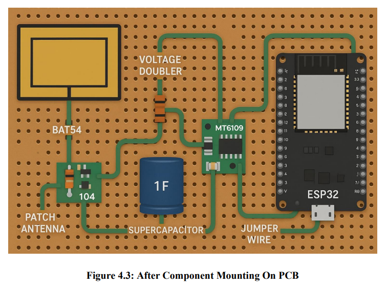
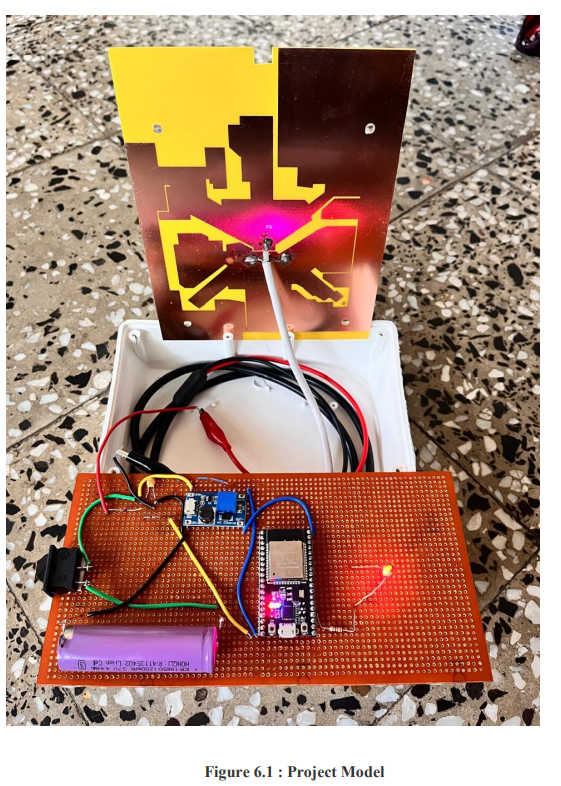

# Energy Harvesting from Wi-Fi Signals  
### A Battery-Free RF Energy Harvesting System for Low-Power IoT Devices

---

## 📌 Project Overview
This project focuses on the design and experimental implementation of an
**RF energy harvesting system** that captures ambient **2.4 GHz Wi-Fi signals**
and converts them into usable DC power.

The system is designed for **battery-free or battery-assisted IoT operation**
by harvesting, storing, and intelligently utilizing ambient RF energy.

---

## 🎯 Objectives
- Harvest ambient Wi-Fi (2.4 GHz) RF energy  
- Convert RF energy into DC power  
- Store harvested energy for later use  
- Power low-power devices reliably using stored energy  

---

## 🧠 System Architecture
The proposed system follows a **stage-wise architecture** designed to efficiently
harvest, store, and utilize low-power ambient Wi-Fi energy.

### System Flow
1. **RF Energy Capture**  
   A 2.4 GHz patch antenna captures ambient Wi-Fi RF signals from nearby routers.

2. **RF-to-DC Conversion**  
   The captured high-frequency AC signal is rectified using a Schottky diode-based
   rectifier circuit to obtain DC voltage.

3. **Energy Storage**  
   The rectified DC energy is stored in a **supercapacitor**, which acts as an energy
   buffer to accumulate charge over time.

4. **Voltage Boosting**  
   A DC-DC boost converter steps up the stored low voltage to a usable level
   (3.3 V / 5 V) required by electronic devices.

5. **Load Operation**  
   A low-power device (ESP32) operates using the stored energy, typically in
   **intermittent or duty-cycled mode**.

This architecture ensures reliable operation despite the low and intermittent
nature of ambient Wi-Fi energy.

---

## 🔋 Energy Storage & Continuous Operation Strategy
Ambient Wi-Fi energy is inherently **low and inconsistent**, making it unsuitable
for directly powering electronic devices in real time.

To overcome this limitation, the system adopts an
**energy-storage-first approach**.

The harvested RF energy is first converted to DC and stored in a supercapacitor.
The stored energy is then used to power the load **only when sufficient energy has
been accumulated**.

### Why Energy Storage Is Necessary
- Wi-Fi signals do not provide constant power levels  
- Instantaneous harvested power is very low  
- Direct powering leads to unstable operation  

### Benefits of Energy Storage
- Enables continuous system availability  
- Allows devices to operate on-demand  
- Supports intermittent but reliable operation  
- Makes the system practical for real-world IoT use cases  

---

## 📖 Documentation Sections
- [Introduction](01_introduction/introduction.md)  
- [Theory – RF Energy Harvesting](02_theory/rf_energy_harvesting.md)  
- [System Architecture & Design](03_system_design/system_architecture.md)  
- [Hardware Implementation](04_hardware_implementation/hardware_implementation.md)  
- [Experimental Results & Performance](05_experimental_results/experimental_results.md)  
- [Applications & Future Scope](06_applications_future_scope/applications_future_scope.md)  
- [Component List & Cost](component_list.md)  
- [References](references.md)  

---

## 🖼 System Diagrams and Hardware

### Block Diagram

### Circuit Diagram

### PCB Layout

### Hardware Setup

---

## 📌 Project Status
- ✔ Hardware prototype implemented  
- ✔ Experimental validation completed  
- ✔ Documentation finalized  
- 🔄 Further optimization possible (antenna efficiency, rectifier design)
